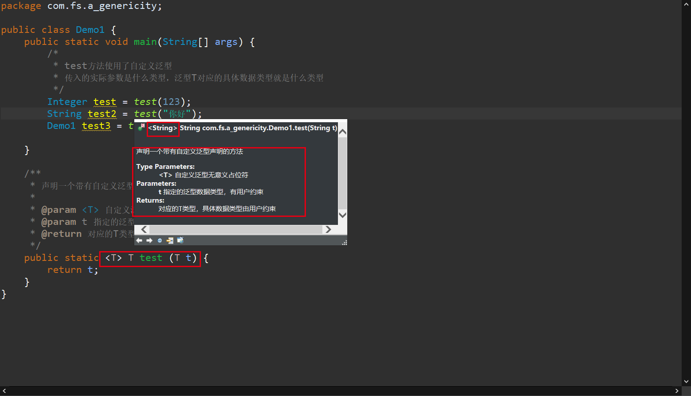

# Java10·范型

[toc]

#### 什么是泛型，引入泛型的原因

```
	目前的项目中，我们的功能代码是需要考虑之后的复用！！！当前代码有且只支持Student类型，如果需要更换数据类型，按照目前的技术，只能重新完成对应数据类型的功能代码。有可能出现各式各样的类型，工作是重复的！！！
	
	这里不单单是对于功能模块的要求封装。同时需要对数据类型进行统一的约束！！！根据用户的要求对应数据类型。

Java中的泛型就是来解决对应的问题
	格式:
		<自定义泛型无意义大写英文字母占位符>
		<T> <E> <K> <V> --建议
		--类型Type,元素Element,键Key,值Value

	泛型可以在方法中使用
	泛型可以在类中使用
	泛型可以在接口中使用
```

#### 泛型在方法中使用

```
使用静态方法举例说明泛型在方法中的使用格式
格式:
	public static <T> 返回值类型[自定义泛型] 方法名(必须存在一个对应泛型的参数) {
		方法体内可以使用自定义泛型
	}
	
使用注意事项：
	1. 自定义泛型声明在返回值之前，以保证方法的参数和返回值都可以使用对应的泛型
	2. 方法声明的泛型，在方法的参数中必须有一个参数是对应声明的自定义泛型。当前参数是用于约束方法内所有使用到泛型的位置对应的具体数据类型是什么。
```

代码

```java
package com.fs.a_genericity;

public class Demo1 {
	public static void main(String[] args) {
		/*
		 * test方法使用了自定义泛型
		 * 传入的实际参数是什么类型，泛型T对应的具体数据类型就是什么类型
		 */
		Integer test = test(123);
		String test2 = test("你好");
		Demo1 test3 = test(new Demo1());
		
		String[] arr1 = {"烤羊排", "黄焖鸡", "烧烤"};
		printArray(arr1);
		
		System.out.println("-----------------");
		
		Integer[] arr2 = {1, 2, 3, 4, 5, 6};
		printArray(arr2);
		
		System.out.println("-----------------");
		
		Demo1[] arr3 = {new Demo1(), new Demo1()};
		printArray(arr3);
	}
	
	/**
	 * 声明一个带有自定义泛型声明的方法
	 * 
	 * @param <T> 自定义泛型无意义占位符
	 * @param t 指定的泛型数据类型，有用户约束
	 * @return 对应的T类型，具体数据类型由用户约束
	 */
	public static <T> T test (T t) {
		return t;
	}
	
	/**
	 * 展示任意类型数组的方式
	 * 
	 * @param <T> 自定义泛型无意义占位符
	 * @param arr 用户指定类型的数组，同时约束自定义泛型对应的具体数据类型
	 */
	public static <T> void printArray(T[] arr) {
		for (int i = 0; i < arr.length; i++) {
			System.out.println(arr[i]);
		}
	}
}

```




#### 泛型在类中使用[有一些难点]

```
格式:
	class 类名<自定义泛型无意义大写字母占位符> {
		在类内的成员变量和成员方法都可以使用自定义泛型
		建议: 成员变量不建议使用自定义泛型
	}
使用注意事项:
	1. 类声明自定义泛型，需要通过创建对象的方式来约束
		TypeA<String> typeA = new TypeA<String>(); Eclipse标准写法
		TypeA<String> typeA = new TypeA<>(); IDEA写法
	2. 类声明泛型约束之后，在类内的所有成员方法中使用的泛型都是类约束的泛型具体数据类型
	3. 如果没有约束类声明泛型，所有使用到泛型的位置都是Object，【不推荐】
	4. 类声明的自定义泛型不能用于类内的静态方法【没有对象】
```

代码：

```java
package com.fs.a_genericity;

/*
 * 定义一个带有自定义泛型的类
 */
class TypeA<T> {
	/**
	 * 使用和类名一致的自定义泛型，需要通过【类对象】约束
	 * 
	 * @param t 对应泛型具体数据类型的参数
	 * @return 对应泛型具体数据类型的返回值
	 */
	public T test1(T t) {
		return t;
	}
	
	/**
	 * 使用和类名一致的自定义泛型，需要通过【类对象】约束
	 * 
	 * @param t 对应泛型具体数据类型的参数
	 * @return 对应泛型具体数据类型的返回值
	 */
	public void test2(T t1, T t2) {
		System.out.println(t1);
		System.out.println(t2);
	}
	
	/*
	 * public static T staaticMethod(T t) {return t;}
	 * 为什么类名自定义的泛型不能用于当前类内的静态成员方法
	 * 		静态成员方法是在类文件的加载阶段准备完毕，已经可以明确的保证改方法可以执行
	 * 	如果使用类声明的自定义泛型，对应泛型的具体数据类型需要在创建类对象之后才能明确
	 * 	当前静态方法在类文件加载阶段无法明确泛型数据类型，也就无法保证执行
	 * 	【没有对象】
	 * 
	 * 
	 * 如果方法想要使用自定义泛型-->自已定义自己使用
	 * 但要求自定义的泛型占位符和类声明泛型占位符不一致，避免没有必要的歧义，提高阅读性、效率。
	 */
	public static<E> E staaticMethod(E e) {
		return e;
	}
}
public class Demo2 {
	public static void main(String[] args) {
		/*
		 * 创建带有自定义泛型类的对象
		 * 
		 * TypeA<String> TypeA = new TypeA<String>(); Eclipse标准写法
		 * TypeA<String> TypeA = new TypeA<>(); IDEA写法
		 */
		// 明确告知编译器，该泛型对应的具体数据
		// 类内所有使用到泛型占位符的位置都是T类型
		TypeA<String> TypeA = new TypeA<String>();
		
		String test1 = TypeA.test1("北京烤鸭");
		TypeA.test2("卤煮", "豆腐");
		
		// 明确告知编译器这里泛型对应的具体数据类型是Demo2类型
		TypeA<Demo2> typeA2 = new TypeA<Demo2>();
		
		Demo2 test12 = typeA2.test1(new Demo2());
		typeA2.test2(new Demo2(),new Demo2());
		
		/*
		 * 没有告知编译器泛型对应的具体数据类型，那么在类内的所有非静态
		 * 成员方法方法中使用到的泛型， 都是Object类型，虽然可以支持任意
		 * 类型传入参数，但是缺少了数据类型一致化的约束。
		 * 
		 * 不推荐！！！
		 */
		TypeA typeA3 = new TypeA();
		
	}
}
```

#### 泛型在接口中使用

```
接口
	interface 接口名 {
		成员变量缺省属性：
			public static final 定义时必须初始化，并且初始化之后无法修改
		成员方法缺省属性：
			public abstract 方法没有方法体
		有方法体如何使用：
			default修饰默认方法，非强制实现方法
	}

泛型在接口中使用格式
	interface 接口名<自定义泛型无意义占位符> {
		问题: 接口的泛型是否可以用于成员变量中
			定义时必须初始化，但是当前泛型的数据类型是不明确的，无法进行初始化过程，和final有关。
		接口中的泛型有且只能用于成员方法！
	}
	
使用注意事项：
	1. 接口声明的泛型，有且只能用于类内的成员方法。
*		问题： default修饰的方法是否可以使用接口声明的自定义泛型
	2. 遵从带有自定义泛型的接口的类，一种可以遵从过程中明确告知泛型具体类型，一种是在创建类对象是明确泛型具体数据类型。
	3. class TypeA<T> implements A<String> 
		正确
			接口的泛型明确接口中的方法，使用泛型对应的具体数据类型
			类声明的泛型用于自定义约束自己类内的方法
	4. class TypeA<E> implements A<T>
		错误
			接口中的泛型没有明确数据类型，也无法通过类创建对象的过程中明确
			泛型对应的具体数据类型，无法编译
```

代码：

```java
package com.fs.a_genericity;

interface A<T> {
	void test(T t);
}

/*
 * 接口带有泛型，遵从接口的实现类有两种方案可以implements当前接口
 * 		1. 自由
 * 		2. 规矩
 */

/**
 * 自由方式，类名之后和接口同名自定义泛型，
 * 泛型对应的具体数据类型是需要在创建当前类对象时进行约束使用的
 * 
 * @author fStardust
 *
 * @param <T> 遵从接口和接口一致的泛型
 */
class TypeB<T> implements A<T> {
	@Override
	public void test(T t) {
		System.out.println("自由模式");
		
	}
}

/**
 * 规矩模式，遵从接口时，接口使用泛型对应的具体数据类型已经明确
 * 在类内使用接口中缺省属性为public abstract方法时，泛型已确认
 * 
 * @author Anonymous
 */
class TypeC<T> implements A<String> {
	@Override
	public void test(String t) {
		System.out.println("规矩模式");
	}
}

public class Demo3 {
	public static void main(String[] args) {
		/*
		 * 自由模式
		 */
		TypeB<Integer> typeB = new TypeB<Integer>();
		typeB.test(10);
		
		TypeB<Character> typeC = new TypeB<Character>();
		typeC.test('A');
		
		/*
		 * 规矩模式
		 */
		TypeC type1 = new TypeC();
		
		type1.test("规矩");

	}
}
```

