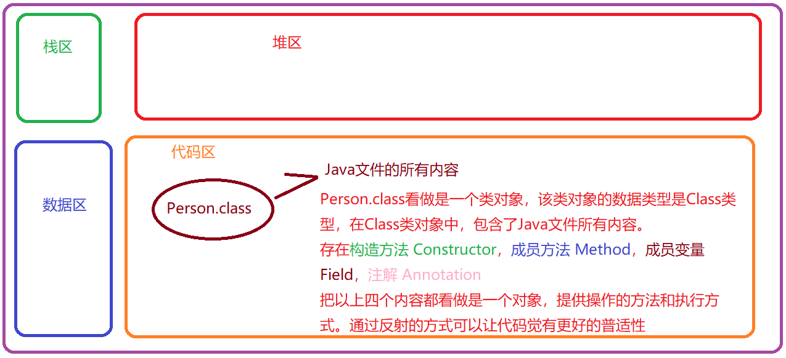
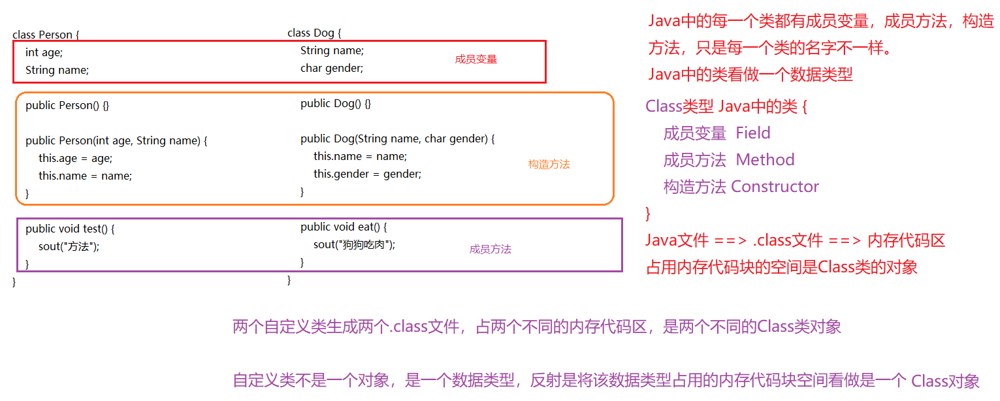

## 反射

#### 1. 反射概述

##### 1.1 Java文件和.class文件的关系

```
Java文件
	Java文件中包含代码的所有内容，类，接口，成员变量，成员方法....

.class字节码问题
	.java文件 通过 javac编译工具生成对应的.class字节码文件
	使用JDK中提供的反编译工具，可以看到.class文件中包含 
		Class 完整的包名.类名
		Field 成员变量，成员变量的名字和成员变量的数据类型[如果是引用数据类型，也是
			完整的包名.类名]
		Method 成员方法，方法权限修饰符，返回值类型，方法名，形式参数列表数据类型

总结：
	.class字节码文件中，包含了Java文件的所有内容
```


##### 1.2 程序加载过程和.class文件的关系

```
	在Java文件运行过程中，当前程序需要哪一个类参与代码执行，那么就需要加载这个类的.class字节码文件，该.class字节码文件时在程序的加载阶段，存在于内存的【代码区】
	
	.class字节码文件既然加载到内存的【代码区】
	.class文件中包含对应Java程序的所有内容
	代码区存在一块空间 ==> .class ==> Java程序的所有内容
```

##### 1.3 Java中的万物皆对象

```
	在Java代码中，把在内存代码区保存的.class字节码内存空间，看做是一个对象。而该对象中包含了对应Java文件的所有内容。
```



##### 1.4 Class到底是什么？

```java
class Person {
    int age;
    String name;
    
    public Person() {}
    
    public Person(int age, String name) {
        this.age = age;
        this.name = name;
    }
    
    public void test() {
        sout("方法");
    }
}

class Dog {
    String name;
    char gender;
    
    public Dog() {}
    
    public Dog(String name, char gender) {
        this.name = name;
        this.gender = gender;
    }
    
    public void eat() {
        sout("狗狗吃肉");
    }
}
```



#### 2. 反射必会方法【重点】

##### 2.1 Class涉及到的方法

```java
Class Class.forName(String packageNameAndClassName);
	Class类的静态成员方法，通过完整的包名.类名获取对应.class文件的Class对象
    同时也可以作为.class文件加载的方法。

Class 类名.class;
    通过类名.class方法，获取对应的Class类对象，通常用于方法的参数类型。

Class 类对象.getClass();
	通过类对象获取对应.class的Class类对象，方法参数，或者说数据类型判断。
```

```java
package com.fs.n_reflect;

/*
Class Class.forName(String packageNameAndClassName);    
	Class类的静态成员方法，通过完整的包名.类名获取对应.class文件的Class对象   
	同时也可以作为.class文件加载的方式。
​Class 类名.class;    
	通过类名.class方法，获取对应的Class类对象，通常用于方法的参数类型。
​Class 类对象.getClass();    
	通过类对象获取对应.class的Class类对象，方法参数，或者说数据类型判断。
 */
public class GetClassObject {
	public static void main(String[] args) throws ClassNotFoundException {
		System.out.println(123456);
		
		Class<?> forName = Class.forName("com.qfedu.a_reflect.Person");
		
		Class<com.fs.n_reflect.Person> cls = Person.class;
		
		Class<? extends Person> class1 = new Person().getClass();
		
		/*
		 * 请问这个三个Class对象是不是同一个Class对象???
		 * 		Class对象对应的是在内存代码区的.class文件占用的内存空间
		 * 		Class引用数据类型变量保存的就是当前空间首地址，
		 * 		Java程序中，.class字节码文件有且只加载一次
		 * 		.class文件占用的空间独一份，不管通过哪一种方式获取对应的Class类对象都是同一个对象
		 */
		System.out.println(forName == cls);
		System.out.println(class1 == cls);
		System.out.println(class1 == forName);
		
		System.out.println("-------------------------");
		
		System.out.println(forName);
		System.out.println(cls);
		System.out.println(class1);
		System.out.println(int.class);
	}
}

```

##### 2.2 Constructor 构造方法类涉及到的方法

```
public Constructor[] getConstructors();
	获取当前Class类对象对应Java文件中，所有【public修饰构造方法的类对象数组】
	
public Constructor[] getDeclaredConstructors();
	【暴力反射】
	获取当前Class类对象对应Java文件中，所有【构造方法的类对象数组】，包括私有化构造方法。
	
【回顾】
	new Person();
	new Person(1);
	因为这里利用了重载的知识点，会根据实际【参数类型】，来选择对应的构造方法。
【推理】
	通过Class类对象，获取指定构造方法，需要根据构造方法的所需的参数数据类型来完成。

public Constructor getConstructor(Class... initArgumentTypes);
	根据指定的数据类型，来选择对应的构造方法，这里可能会抛出异常。
	这里有且只能获取获取类内的指定数据类型public修饰构造方法类对象
	Class: 约束数据类型，当前方法所需的参数类型
		例如: 
			这里需要int类型 int.class
			这里需要String类型 String.class
			之类需要Perosn类型 Person.class
		异常:
			NoSuchMethodException
	... : 不定长参数
		构造方法需要的参数类型是很多的，有可能无参数，有可能有参数。... 不定长参数
		类约束使用，增强代码的普适性
		例如:
			这里无参数 () or (null)
			参数类型int类型 (int.class)
			参数类型int, String类型 (int.class, String.class)
	initArgumentTypes:参数名 
	初始化参数类型复数
		
public Constructor getDeclaredConstructor(Class... initArgumentTypes);
	【暴力反射】
	根据指定的数据类型，来选择对应的构造方法，这里可能会抛出异常。
	这里可以获取指定参数类型私有化构造方法和非私有化构造方法
	Class: 约束数据类型，当前方法所需的参数类型
		例如: 
			这里需要int类型 int.class
			这里需要String类型 String.class
			之类需要Perosn类型 Person.class
		异常:
			NoSuchMethodException
	... : 不定长参数
		构造方法需要的参数类型是很多的，有可能无参数，有可能有参数。使用不定长参数类约束使用，增强代码的普适性
		例如:
			这里无参数 () or (null)
			参数类型int类型 (int.class)
			参数类型int, String类型 (int.class, String.class)
	initArgumentTypes:参数名 
		初始化参数类型复数
		
Object newInstance(Object... initArguments);
	通过Constructor对象来调用，传入当前构造方法所需创建对象的初始化参数，创建对象。
	Object: Object类是Java中所有类的基类，这里可以传入任意类型的参数
	... : 不定长参数，因为Constructor类对象在获取的过程中，约束的参数个数都不确定，
	这里使用不定长参数来传入数据
```

代码

```java
package com.fs.n_reflect;

import java.lang.reflect.Constructor;
import java.lang.reflect.InvocationTargetException;

/*
 * 操作Constructor
 */
public class GetConstructorObject {
	public static void main(String[] args) 
			throws ClassNotFoundException, NoSuchMethodException, 
			SecurityException, InstantiationException, IllegalAccessException, 
			IllegalArgumentException, InvocationTargetException {
		/*
		 * 根据指定的包名.类名， 获取对应的Class对象
		 */
		Class<?> cls = Class.forName("com.fs.n_reflect.Person");
		
		/* 
		 * 获取当前Person类内所有非私有化构造方法
		 */
		Constructor<?>[] constructors = cls.getConstructors();
		for (Constructor<?> constructor : constructors) {
			System.out.println(constructor);
		}
		
		System.out.println("--------------------");
		System.out.println();
		
		/*
		 * 暴力反射，获取Person类内所有的构造方法，包括私有化构造方法
		 */
		Constructor<?>[] declaredConstructors = cls.getDeclaredConstructors();
		for (Constructor<?> constructor : declaredConstructors) {
			System.out.println(constructor);
		}
		
		System.out.println("--------------------");
		System.out.println();
		
		/*
		 * 根据指定参数类型获取public修饰的构造方法对象
		 * 如果没有指定参数的构造方法，运行异常java.lang.NoSuchMethodException
		 */
		Constructor<?> constructor1 = cls.getConstructor();
		Constructor<?> constructor2 = cls.getConstructor(int.class);
		Constructor<?> constructor3 = cls.getConstructor(int.class, String.class);
		System.out.println(constructor1);
		System.out.println(constructor2);
		System.out.println(constructor3);
		
		 // Constructor<?> constructor = cls.getConstructor(String.class);
		 // System.out.println(constructor);
		
		System.out.println("--------------------");
		System.out.println();
		
		/*
		 * 通过暴力反射可以获取任意权限修饰符，符合参数要求的构造方法对象
		 */
		Constructor<?> declaredConstructor1 = cls.getDeclaredConstructor();
		Constructor<?> declaredConstructor2 = cls.getDeclaredConstructor(String.class);
		System.out.println(declaredConstructor1);
		System.out.println(declaredConstructor2);
		
		System.out.println("--------------------");
		System.out.println();
		
		/*
		 * 通过无参数Constructor对象执行newInstance方法
		 * 这里明确是一个Person类型，可以使用强制类型转换
		 * 这里使用的是public修饰的构造方法
		 */
		Person p1 = (Person) constructor1.newInstance();
		System.out.println(p1);
		System.out.println(new Person());
		System.out.println(constructor3.newInstance(1, "张三"));
		
		System.out.println("--------------------");
		System.out.println();
		
		// 给予通过暴力反射获取到的非公开权限成员变量，成员方法，构造方法，操作权限
		declaredConstructor2.setAccessible(true);
		Person p2 = (Person) declaredConstructor2.newInstance("张三");
		System.out.println(p2);
		
	}
}
```

##### 2.3 Method成员方法涉及到的方法

```
问题:
	请问调用执行成员方法时，有哪些需要考虑的内容？
		调用者
			类名，对象
		方法名
		参数
	
	如果需要通过Class对象来获取Method对象，你认为有哪些必要的内容需要考虑?
		参数
		方法名
		权限修饰符
```

```
Method[] getMethods();
	获取类内所有public修饰的成员方法，包括从父类继承而来的public修饰方法。

Method[] getDeclaredMethods();
	暴力反射
	获取类内所有成员方法，但是不包括从父类继承而来的方法。

Method getMethod(String methodName, Class... parameterTypes);
	根据指定的方法名和对应的参数类型，获取对应的public修饰的成员方法
	methodName: 
		方法名，指定获取的是哪一个方法
	parameterTypes:
		Class用于约束当前使用你的参数数据类型
		... 不定长参数，方法参数个数，顺序，有参无参问题
	例如：
		cls是Class类对象
		cls.getMethod("setName", String.class);
		cls.getMethod("getName");		

Method getDeclaredMethod(String methodName, Class... parameterTypes);
	根据指定的方法名和对应的参数类型，获取对应的成员方法，包括私有化成员方法，但是不包括从父类继承而来的方法
	methodName: 
		方法名，指定获取的是哪一个方法
	parameterTypes:
		Class用于约束当前使用你的参数数据类型
		... 不定长参数，方法参数个数，顺序，有参无参问题
	例如：
		cls是Class类对象
		cls.getMethod("setName", String.class);
		cls.getMethod("getName");		

Object invoke(Object obj, Object... arguments);
	通过Method类对象调用，执行对应的方法，需要的参数
	obj : 
		执行当前方法的执行者
	arguments:
		Object... 不定长参数，当前方法执行所需的实际参数，
```

```java
package com.fs.n_reflect;

import java.lang.reflect.InvocationTargetException;
import java.lang.reflect.Method;

/*
 * Method成员方法涉及到的内容
 */
public class GetMethodObject {
	public static void main(String[] args) 
			throws ClassNotFoundException, 
			NoSuchMethodException, SecurityException, InstantiationException, IllegalAccessException, IllegalArgumentException, InvocationTargetException {
		/*
		 * 根据指定的包名.类名，获取对应的Class对象
		 */
		Class<?> cls = Class.forName("com.fs.n_reflect.Person");
		
		/*
		 * 获取类内所有public修饰的成员方法，包括从父类继承而来的方法
		 */
		Method[] methods = cls.getMethods();
		for (Method method : methods) {
			System.out.println(method);
		}
		
		System.out.println("------------------------");
		System.out.println();
		
		/*
		 * 获取类内所有成员方法，包括私有化成员方法，但是不包括父类继承而来的
		 */
		Method[] declaredMethods = cls.getDeclaredMethods();
		for (Method method : declaredMethods) {
			System.out.println(method);
		}
		
		System.out.println("------------------------");
		System.out.println();
		
		/*
		 * 根据指定的方法名和参数类型，获取类内public修饰的成员方法
		 */
		Method game1 = cls.getMethod("game");
		Method game2 = cls.getMethod("game", String.class);
		//	Method game3 = cls.getMethod("game", int.class);
		
		System.out.println(game1);
		System.out.println(game2);
		
		System.out.println("------------------------");
		System.out.println();
		
		/*
		 * 根据指定的方法名和参数类型，获取类内private修饰的成员方法
		 * 暴力反射
		 */
		Method declaredMethod1 = cls.getDeclaredMethod("testPrivate");
		Method declaredMethod2 = cls.getDeclaredMethod("testPrivate", String.class);
		
		System.out.println(declaredMethod1);
		System.out.println(declaredMethod2);
		
		System.out.println("------------------------");
		System.out.println();
		
		/*
		 * 执行public修饰的成员方法
		 */
		Object obj = cls.getConstructor().newInstance();
		game1.invoke(obj);
		game2.invoke(obj, "坦克大战");
		
		System.out.println("------------------------");
		System.out.println();
		
		/*
		 * 基于暴力反射操作权限的情况下，执行私有化成员方法
		 */
		declaredMethod1.setAccessible(true);
		declaredMethod1.invoke(obj);
		
		declaredMethod2.setAccessible(true);
		declaredMethod2.invoke(obj, "烤羊排");
	}
}

```

##### 2.4 Field成员变量涉及到方法

```
Field[] getFields();
	获取类内所有public修饰的成员变量
Field[] getDeclaredFields();
	获取类内所有成员变量，包括私有化成员方法

Field getField(String fieldName);
	获取指定变量名的成员变量对象，要求是public修饰的成员变量

Field getDeclaredField(String fieldName);
	获取指定变量名的成员变量对象，包括private私有化修饰的成员变量
	
void set(Object obj, Object value);
	设置指定调用者中对应成员变量的数据
	obj : 调用者
	value: 对应当前成员变量需要赋值的内容
Object get(Object obj);
	获取指定调用者中指定成员变量的数据
	obj: 调用者
```

```java
package com.fs.n_reflect;

import java.lang.reflect.Field;
import java.lang.reflect.InvocationTargetException;

/*
 * 获取成员变量Field对象
 */
public class GetFieldObject {
	public static void main(String[] args) 
			throws ClassNotFoundException, 
			NoSuchFieldException, SecurityException, 
			InstantiationException, IllegalAccessException, 
			IllegalArgumentException, InvocationTargetException, 
			NoSuchMethodException {
		/*
		 * 根据指定的包名.类名，获取对应的Class对象
		 */
		Class<?> cls = Class.forName("com.qfedu.a_reflect.Person");
		
		Field[] fields = cls.getFields();
		for (Field field : fields) {
			System.out.println(field);
		}
		
		System.out.println("--------------------");
		System.out.println();
		
		Field[] declaredFields = cls.getDeclaredFields();
		for (Field field : declaredFields) {
			System.out.println(field);
		}
		
		System.out.println("--------------------");
		System.out.println();
		
		Field field = cls.getField("test");
		System.out.println(field);
		
		System.out.println("--------------------");
		System.out.println();
		
		Field id = cls.getDeclaredField("id");
		Field name = cls.getDeclaredField("name");
		
		System.out.println(id);
		System.out.println(name);
		
		System.out.println("--------------------");
		System.out.println();
		
		Object obj = cls.getConstructor().newInstance();
		System.out.println(obj);
		
		field.set(obj, 20);
		System.out.println(obj);
		
		id.setAccessible(true);
		name.setAccessible(true);
		
		id.set(obj, 1);
		name.set(obj, "foo");
		
		System.out.println(obj);
		
		System.out.println(field.get(obj));
		System.out.println(id.get(obj));
		System.out.println(name.get(obj));
	}
}

```

##### 2.5 给予暴力反射私有化内容的权限操作

setAccessible(boolean flag);

给予Constructor，Method, Field对象，私有化内容，操作权限设置

true表示可以操作

